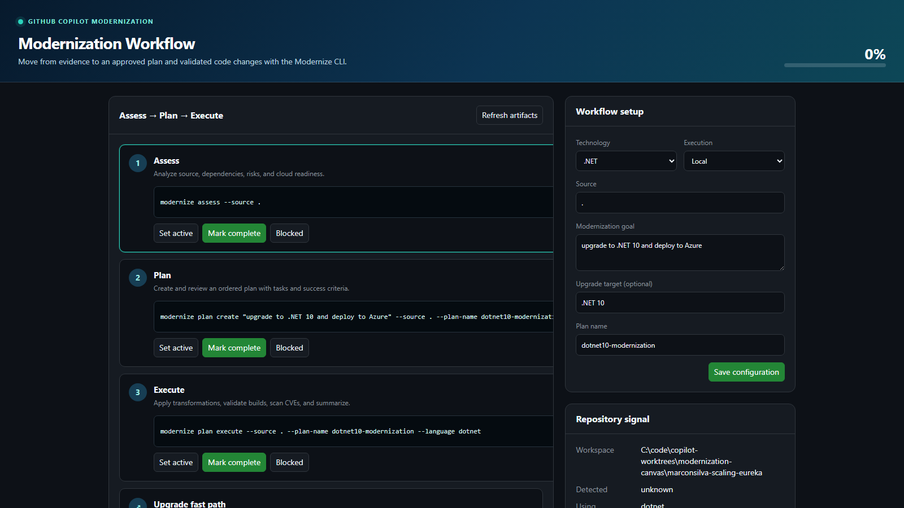

# GitHub Copilot Modernization Workflow Canvas

An interactive canvas for following the
[GitHub Copilot Modernize CLI](https://github.com/microsoft/modernize-cli)
workflow while modernizing .NET, Java, or C++ applications.



## What it does

- Presents the governed **Assess → Plan → Execute** lifecycle as a live workflow.
- Detects .NET, Java, and C++ repository signals.
- Generates commands from the documented Modernize CLI command surface.
- Discovers assessment, plan, task, progress, and summary artifacts under
  `.github/modernize/`.
- Persists manual progress in the application repository.
- Supports local and cloud-agent delegation.
- Exposes actions so Copilot can configure and refresh the canvas.

> [!NOTE]
> The current Modernize CLI reference documents explicit `--language` values for
> Java and .NET. For C++, the canvas uses CLI auto-detection and displays a
> compatibility notice so users can verify support in their installed CLI.

## Use in this repository

Clone the repository and start Copilot CLI from its root. The project-local
entry point in `.github/extensions/modernization-workflow/` loads automatically.
Ask Copilot to open the **Modernization Workflow** canvas.

## Use as a plugin

The distributable plugin is defined by `plugin.json`; its reusable extension
source is in `extensions/modernization-workflow/`. The plugin has no runtime
dependencies beyond the Copilot CLI extension SDK.

To publish through [Awesome Copilot](https://github.com/github/awesome-copilot):

1. Make this GitHub repository public.
2. Create an immutable semantic-version release tag, such as `v1.0.0`.
3. Record the release tag and full 40-character commit SHA.
4. Submit the external plugin issue form in `github/awesome-copilot`, using `/`
   as the plugin path.
5. Run the Awesome Copilot intake checks and address any `vally lint` or install
   smoke-test findings.

Do not edit `plugins/external.json` directly; approved submissions are added by
the Awesome Copilot review automation.

## Modernize CLI workflow

```text
modernize assess --source .
modernize plan create "modernize this application for Azure" --source . --plan-name modernization-plan
modernize plan execute --source . --plan-name modernization-plan
```

The canvas also surfaces `modernize upgrade` as the documented end-to-end fast
path while keeping the reviewable Assess, Plan, and Execute workflow primary.

## References

- [Modernize CLI](https://github.com/microsoft/modernize-cli)
- [Modernization agent overview](https://learn.microsoft.com/azure/developer/github-copilot-app-modernization/modernization-agent/overview)
- [Modernize CLI commands](https://learn.microsoft.com/azure/developer/github-copilot-app-modernization/modernization-agent/cli-commands)
- [Awesome Copilot contribution guide](https://github.com/github/awesome-copilot/blob/main/CONTRIBUTING.md)

## License

MIT
